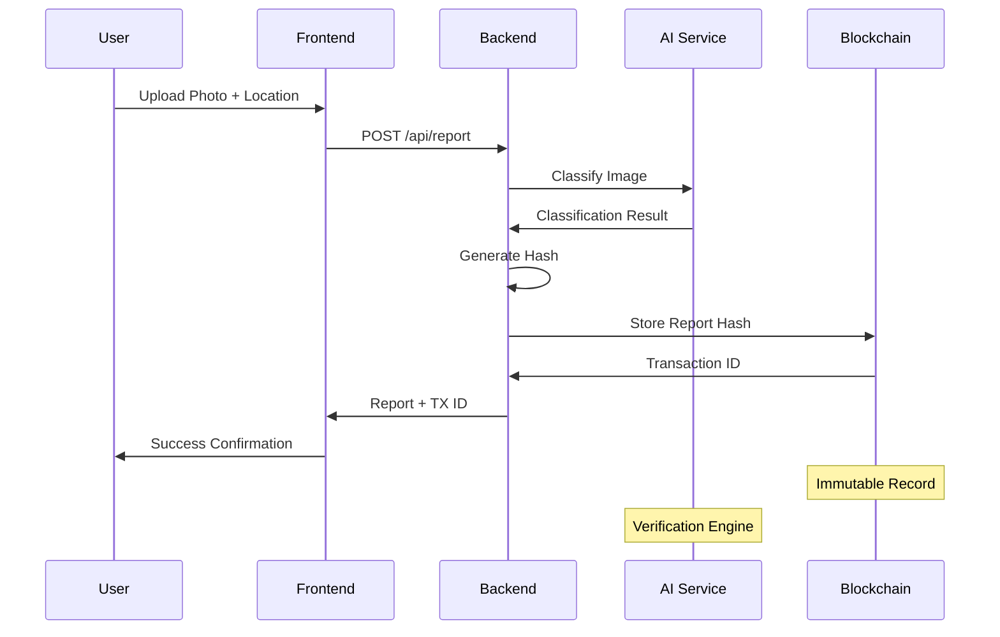

# 🚗 DeParkAlert - Complete Architecture Documentation

## 📋 Overview
**DeParkAlert** — Real-Time Traffic Intelligence on Decentralized Infrastructure

Sistem monitoring parkir dan lalu lintas terdesentralisasi yang menggabungkan AI-based image classification, blockchain verification (TON Network), dan decentralized storage untuk menciptakan ekosistem pelaporan lalu lintas yang transparan dan terverifikasi.

## 🏗️ Technology Stack Matrix

| Layer | Technology | Purpose |
|-------|------------|---------|
| **Frontend** | Next.js 16 (App Router), React 19, TypeScript 5 | User interface & DApp interaction |
| **Styling** | TailwindCSS 4, shadcn/ui, Radix UI | Modern UI components |
| **Backend** | Node.js 22 + Express + MongoDB | API & AI processing layer |
| **AI Engine** | TensorFlow.js / ONNX Runtime | Image classification & verification |
| **Blockchain** | TON Network, TonConnect SDK, Smart Contracts (TypeScript) | Decentralized verification layer |
| **Storage** | IPFS / Cloudinary | Decentralized file storage |
| **Maps** | Mapbox / Leaflet | Interactive mapping |
| **Deployment** | Vercel (frontend) + Render/Railway (backend) | Cloud infrastructure |

---

## 🎯 Architecture Overview

```
┌─────────────────┐    ┌─────────────────┐    ┌─────────────────┐
│   Frontend      │    │    Backend      │    │   Blockchain    │
│   (DApp Layer)  │◄──►│   (API & AI)    │◄──►│   (TON Network) │
│                 │    │                 │    │                 │
│ • Landing Page  │    │ • AI Inference  │    │ • Smart Contract│
│ • DApp UI       │    │ • Hash Generator │    │ • Transaction   │
│ • Wallet Conn.  │    │ • Storage API   │    │ • Verification  │
│ • Map View      │    │ • Database CRUD │    │ • Rewards       │
└─────────────────┘    └─────────────────┘    └─────────────────┘
         │                       │                       │
         └───────────────────────┼───────────────────────┘
                                 │
                    ┌─────────────────┐
                    │  Storage Layer  │
                    │                 │
                    │ • IPFS          │
                    │ • Cloudinary    │
                    │ • Metadata      │
                    └─────────────────┘
```

---

## 🧱 Layer 1: Frontend (DApp Layer / Client Layer)

### 📁 Structure

```
frontend/
├── 📁 app/                          # Next.js App Router
│   ├── 📁 (landing)/                # Landing page routes
│   │   ├── 📄 page.tsx             # Public landing page
│   │   ├── 📄 layout.tsx           # Landing layout
│   │   └── 📄 globals.css          # Landing styles
│   │
│   ├── 📁 (dapp)/                   # Authenticated DApp routes
│   │   ├── 📄 page.tsx             # Main DApp dashboard
│   │   ├── 📄 layout.tsx           # DApp layout (with wallet)
│   │   ├── 📁 report/              # Reporting functionality
│   │   │   ├── 📄 page.tsx         # Report submission
│   │   │   └── 📄 success.tsx      # Success confirmation
│   │   ├── 📁 map/                 # Map view
│   │   │   └── 📄 page.tsx         # Interactive map
│   │   ├── 📁 leaderboard/         # Rewards & leaderboard
│   │   │   └── 📄 page.tsx         # Leaderboard page
│   │   └── 📁 profile/             # User profile
│   │       └── 📄 page.tsx         # Profile & settings
│   │
│   └── 📄 globals.css              # Global styles
│   └── 📄 layout.tsx               # Root layout
│
├── 📁 components/                   # React components
│   ├── 📁 landing/                  # Landing page components
│   │   ├── 📄 hero.tsx             # Hero section
│   │   ├── 📄 features.tsx         # Features showcase
│   │   ├── 📄 how-it-works.tsx     # Process explanation
│   │   ├── 📄 cta.tsx              # Call-to-action
│   │   └── 📄 dashboard-preview.tsx # Dashboard preview
│   │
│   ├── 📁 dapp/                     # DApp specific components
│   │   ├── 📄 upload-form.tsx      # Photo upload form
│   │   ├── 📄 map-view.tsx         # Interactive map component
│   │   ├── 📄 report-card.tsx      # Report display card
│   │   ├── 📄 leaderboard.tsx      # Rewards leaderboard
│   │   ├── 📄 wallet-connect.tsx   # Wallet connection
│   │   ├── 📄 transaction-status.tsx # TX status indicator
│   │   └── 📄 reward-badge.tsx     # Achievement badges
│   │
│   ├── 📁 shared/                   # Shared components
│   │   ├── 📄 navbar.tsx           # Navigation bar
│   │   ├── 📄 footer.tsx           # Footer
│   │   └── 📄 loading-spinner.tsx  # Loading states
│   │
│   └── 📁 ui/                       # shadcn/ui components
│       ├── 📄 button.tsx           # Button component
│       ├── 📄 card.tsx             # Card component
│       ├── 📄 input.tsx            # Input component
│       ├── 📄 badge.tsx            # Badge component
│       ├── 📄 tabs.tsx             # Tabs component
│       ├── 📄 dialog.tsx           # Modal/dialog
│       ├── 📄 toast.tsx            # Toast notifications
│       └── 📄 progress.tsx         # Progress indicators
│
├── 📁 hooks/                        # Custom React hooks
│   ├── 📄 use-ton-connect.tsx      # TON wallet connection
│   ├── 📄 use-mobile.tsx           # Mobile detection
│   ├── 📄 use-toast.tsx            # Toast notifications
│   ├── 📄 use-reports.tsx          # Reports data management
│   ├── 📄 use-location.tsx         # Geolocation
│   └── 📄 use-ai-prediction.tsx    # AI prediction states
│
├── 📁 lib/                          # Utility libraries
│   ├── 📄 utils.ts                 # General utilities
│   ├── 📄 ton-client.ts            # TON client configuration
│   ├── 📄 api-client.ts            # API communication
│   ├── 📄 map-utils.ts             # Map utilities
│   └── 📄 constants.ts             # App constants
│
├── 📁 types/                        # TypeScript type definitions
│   ├── 📄 report.ts                # Report types
│   ├── 📄 user.ts                  # User types
│   ├── 📄 blockchain.ts            # Blockchain types
│   └── 📄 api.ts                   # API response types
│
└── 📁 public/                       # Static assets
    ├── 🖼️ icons/                   # App icons & logos
    ├── 🖼️ images/                  # Landing page images
    └── 📄 manifest.json            # PWA manifest
```

### 🎯 Key Components Breakdown

#### **Landing Page Components**
- **Hero Section**: Jelasin value proposition
- **Features**: Showcase AI + Blockchain benefits
- **How It Works**: Step-by-step process visualization
- **Dashboard Preview**: Preview dari authenticated DApp
- **CTA**: "Launch App" button untuk masuk ke DApp

#### **DApp Core Components**
- **Upload Form**: Multi-step form untuk upload foto + lokasi
- **Map View**: Interactive map dengan report markers
- **Wallet Connect**: TonConnect integration untuk Web3 login
- **Leaderboard**: Reward system dengan ranking users
- **Transaction Status**: Real-time blockchain transaction updates

### 🔧 Key Technologies & Libraries

```json
{
  "core": {
    "next": "16.0.0",
    "react": "19.2.0",
    "typescript": "^5"
  },
  "ui": {
    "@radix-ui/react-*": "latest",
    "tailwindcss": "^4.1.9",
    "lucide-react": "^0.454.0"
  },
  "blockchain": {
    "@tonconnect/ui-react": "^2.0.0",
    "ton": "^13.11.0",
    "tonweb": "^0.0.66"
  },
  "maps": {
    "@mapbox/mapbox-gl-js": "^3.0.0",
    "leaflet": "^1.9.0",
    "react-leaflet": "^4.0.0"
  },
  "utilities": {
    "axios": "^1.6.0",
    "clsx": "^2.1.1",
    "tailwind-merge": "^2.5.5"
  }
}
```

---

## ⚙️ Layer 2: Backend (API & AI Layer)

### 📁 Structure

```
backend/
├── 📁 src/                          # Source code
│   ├── 📄 app.js                    # Express app entry point
│   ├── 📄 server.js                 # Server startup
│   │
│   ├── 📁 controllers/              # Route controllers
│   │   ├── 📄 reportController.js   # Report CRUD operations
│   │   ├── 📄 userController.js     # User management
│   │   ├── 📄 aiController.js       # AI inference endpoints
│   │   └── 📄 blockchainController.js # Blockchain operations
│   │
│   ├── 📁 services/                 # Business logic services
│   │   ├── 📄 aiService.js          # AI inference engine
│   │   ├── 📄 hashUtil.js           # Hash generation (keccak256)
│   │   ├── 📄 blockchainService.js  # TON blockchain interactions
│   │   ├── 📄 storageService.js     # IPFS/Cloudinary uploads
│   │   └── 📄 rewardService.js      # Reward calculations
│   │
│   ├── 📁 models/                   # Database models
│   │   ├── 📄 Report.js             # Report schema
│   │   ├── 📄 User.js               # User schema
│   │   └── 📄 Transaction.js        # Transaction schema
│   │
│   ├── 📁 middleware/               # Express middleware
│   │   ├── 📄 auth.js               # Authentication middleware
│   │   ├── 📄 validation.js         # Request validation
│   │   ├── 📄 rateLimit.js          # Rate limiting
│   │   └── 📄 errorHandler.js       # Error handling
│   │
│   ├── 📁 routes/                   # API routes
│   │   ├── 📄 reports.js            # Report endpoints
│   │   ├── 📄 users.js              # User endpoints
│   │   ├── 📄 ai.js                 # AI inference endpoints
│   │   └── 📄 blockchain.js         # Blockchain endpoints
│   │
│   ├── 📁 utils/                    # Utility functions
│   │   ├── 📄 logger.js             # Logging utilities
│   │   ├── 📄 config.js             # Configuration management
│   │   └── 📄 constants.js          # App constants
│   │
│   └── 📁 ai/                       # AI model files
│       ├── 📄 model/                # TensorFlow.js model files
│       │   ├── 📄 model.json        # Model architecture
│       │   └── 📄 weights.bin       # Model weights
│       └── 📄 inference.js          # AI inference logic
│
├── 📁 tests/                        # Test files
│   ├── 📁 unit/                     # Unit tests
│   ├── 📁 integration/              # Integration tests
│   └── 📁 fixtures/                 # Test data
│
├── 📄 package.json                  # Dependencies & scripts
├── 📄 .env.example                  # Environment variables template
└── 📄 README.md                     # Backend documentation
```

### 🔄 Data Flow Pipeline

```mermaid
graph TD
    A[Frontend Upload] --> B[/api/report POST]
    B --> C[Validation Middleware]
    C --> D[AI Service Inference]
    D --> E[Hash Generation]
    E --> F[Storage Service]
    F --> G[Blockchain Service]
    G --> H[Database Storage]
    H --> I[Response to Frontend]

    D --> D1[TensorFlow.js Model]
    D1 --> D2[Classification Result]
    D2 --> D3[Confidence Score]

    E --> E1[keccak256 Hash]
    E1 --> E2[Report Metadata]

    G --> G1[TON Smart Contract]
    G1 --> G2[Transaction ID]
    G2 --> G3[Blockchain Confirmation]
```

### 🧠 AI Service Architecture

```javascript
// aiService.js structure
class AIService {
  async classifyImage(imageBuffer) {
    // 1. Preprocessing
    const processedImage = await this.preprocessImage(imageBuffer);

    // 2. TensorFlow.js Inference
    const prediction = await this.model.predict(processedImage);

    // 3. Post-processing
    const result = this.postprocessPrediction(prediction);

    return {
      classification: result.class, // 'normal', 'full', 'illegal'
      confidence: result.score,
      bbox: result.boundingBox,
      timestamp: new Date()
    };
  }

  // Classifications:
  // - normal: Parkir normal
  // - full: Parkir penuh
  // - illegal: Parkir ilegal
}
```

### 🔗 Blockchain Service Integration

```javascript
// blockchainService.js structure
class BlockchainService {
  async storeReportHash(reportData) {
    // 1. Generate hash
    const reportHash = this.generateKeccak256Hash(reportData);

    // 2. Connect to TON network
    const tonClient = await this.getTONClient();

    // 3. Create transaction
    const transaction = await this.contract.sendTransaction({
      method: 'storeReport',
      params: {
        reportHash: reportHash,
        timestamp: Date.now(),
        reporter: reportData.walletAddress
      }
    });

    return {
      transactionHash: transaction.txHash,
      blockNumber: transaction.blockNumber,
      confirmations: await this.getConfirmations(transaction.txHash)
    };
  }
}
```

### 📦 Key Dependencies

```json
{
  "backend": {
    "express": "^4.18.0",
    "mongoose": "^8.0.0",
    "multer": "^1.4.0",
    "cors": "^2.8.5",
    "helmet": "^7.0.0",
    "dotenv": "^16.0.0"
  },
  "ai": {
    "@tensorflow/tfjs": "^4.10.0",
    "@tensorflow/tfjs-node": "^4.10.0",
    "sharp": "^0.32.0",
    "jimp": "^0.22.0"
  },
  "blockchain": {
    "ton": "^13.11.0",
    "tonweb": "^0.0.66",
    "ethers": "^6.0.0"
  },
  "storage": {
    "ipfs-http-client": "^60.0.0",
    "cloudinary": "^1.40.0"
  },
  "utilities": {
    "keccak256": "^1.0.6",
    "axios": "^1.6.0",
    "winston": "^3.10.0"
  }
}
```

---

## 🔗 Layer 3: Blockchain (DePIN Layer / TON Network)

### 🏗️ Smart Contract Architecture

```solidity
// DeParkAlert Smart Contract (TypeScript/Tact)
contract DeParkAlert {
    // State variables
    mapping(uint256 => Report) public reports;
    mapping(address => User) public users;
    uint256 public reportCounter;

    // Structs
    struct Report {
        uint256 id;
        bytes32 reportHash;
        address reporter;
        uint256 timestamp;
        ReportStatus status;
        uint256 rewardAmount;
    }

    struct User {
        address wallet;
        uint256 totalReports;
        uint256 totalRewards;
        uint256 reputation;
        bool isActive;
    }

    // Enums
    enum ReportStatus { Pending, Verified, Rejected, Disputed }

    // Events
    event ReportSubmitted(uint256 indexed reportId, address indexed reporter, bytes32 reportHash);
    event ReportVerified(uint256 indexed reportId, address indexed verifier);
    event RewardDistributed(address indexed user, uint256 amount);

    // Functions
    function submitReport(bytes32 reportHash) external returns (uint256);
    function verifyReport(uint256 reportId, bool isValid) external;
    function distributeReward(uint256 reportId) external;
    function getUserReports(address user) external view returns (uint256[] memory);
}
```

### 🎯 Core Smart Contract Functions

#### 1. **Report Submission**
```typescript
// Submit new traffic report to blockchain
async function submitReport(reportHash: string, reporterAddress: string) {
  const transaction = await contract.sendInternalMessage({
    to: contractAddress,
    value: toNano('0.1'), // Transaction fee
    body: beginCell()
      .storeUint(1, 32) // Function ID for submitReport
      .storeBuffer(Buffer.from(reportHash))
      .storeAddress(Address.parse(reporterAddress))
      .endCell()
  });

  return transaction;
}
```

#### 2. **AI Verification**
```typescript
// Store AI verification result on-chain
async function verifyReport(reportId: number, isValid: boolean, confidence: number) {
  const transaction = await contract.sendInternalMessage({
    to: contractAddress,
    value: toNano('0.05'),
    body: beginCell()
      .storeUint(2, 32) // Function ID for verifyReport
      .storeUint(reportId, 64)
      .storeBit(isValid)
      .storeUint(Math.floor(confidence * 100), 8) // Confidence as percentage
      .endCell()
  });

  return transaction;
}
```

#### 3. **Reward Distribution**
```typescript
// Distribute rewards for verified reports
async function distributeReward(reportId: number, rewardAmount: number) {
  const transaction = await contract.sendInternalMessage({
    to: contractAddress,
    value: toNano(rewardAmount.toString()),
    body: beginCell()
      .storeUint(3, 32) // Function ID for distributeReward
      .storeUint(reportId, 64)
      .endCell()
  });

  return transaction;
}
```

### 🔐 Security Features

1. **Hash Verification**: Semua report di-hash dengan keccak256
2. **Timestamp Validation**: Anti-spam dengan timestamp checks
3. **Rate Limiting**: Prevent spam reports per wallet
4. **Reputation System**: User reputation affects rewards
5. **Dispute Mechanism**: Community verification for disputed reports

### 📊 Transaction Flow



---

## 🗄️ Layer 4: Storage Layer

### 📁 IPFS Integration

```javascript
// storageService.js
class StorageService {
  async uploadToIPFS(fileBuffer) {
    const { cid } = await ipfs.add(fileBuffer);
    return {
      ipfsHash: cid.toString(),
      ipfsUrl: `https://ipfs.io/ipfs/${cid}`,
      timestamp: Date.now()
    };
  }

  async uploadToCloudinary(fileBuffer, metadata) {
    const result = await cloudinary.v2.uploader.upload(fileBuffer, {
      folder: 'deparkalert-reports',
      resource_type: 'auto',
      metadata: metadata
    });

    return {
      cloudinaryUrl: result.secure_url,
      publicId: result.public_id,
      metadata: metadata
    };
  }
}
```

### 📊 Database Schema (MongoDB)

```javascript
// Report Schema
const ReportSchema = new mongoose.Schema({
  reportId: { type: String, unique: true, required: true },
  walletAddress: { type: String, required: true },
  location: {
    lat: { type: Number, required: true },
    lng: { type: Number, required: true },
    address: String
  },
  imageData: {
    ipfsHash: String,
    cloudinaryUrl: String,
    originalName: String
  },
  aiClassification: {
    label: { type: String, enum: ['normal', 'full', 'illegal'] },
    confidence: { type: Number, min: 0, max: 1 },
    bbox: {
      x: Number,
      y: Number,
      width: Number,
      height: Number
    }
  },
  blockchain: {
    reportHash: { type: String, required: true },
    transactionHash: String,
    blockNumber: Number,
    confirmations: Number
  },
  status: {
    type: String,
    enum: ['pending', 'verified', 'rejected', 'disputed'],
    default: 'pending'
  },
  reward: {
    amount: { type: Number, default: 0 },
    token: { type: String, default: 'TON' },
    distributed: { type: Boolean, default: false }
  },
  createdAt: { type: Date, default: Date.now },
  verifiedAt: Date
});

// User Schema
const UserSchema = new mongoose.Schema({
  walletAddress: { type: String, unique: true, required: true },
  profile: {
    username: String,
    email: String,
    avatar: String
  },
  stats: {
    totalReports: { type: Number, default: 0 },
    verifiedReports: { type: Number, default: 0 },
    totalRewards: { type: Number, default: 0 },
    reputation: { type: Number, default: 100 }
  },
  achievements: [{
    type: String,
    unlockedAt: Date
  }],
  isActive: { type: Boolean, default: true },
  lastActivity: Date,
  createdAt: { type: Date, default: Date.now }
});
```

---

## 🚀 Deployment Architecture

### 🌐 Frontend Deployment (Vercel)

```yaml
# vercel.json
{
  "framework": "nextjs",
  "buildCommand": "npm run build",
  "outputDirectory": ".next",
  "installCommand": "npm install",
  "env": {
    "NEXT_PUBLIC_TON_API_KEY": "@ton-api-key",
    "NEXT_PUBLIC_MAPBOX_TOKEN": "@mapbox-token",
    "NEXT_PUBLIC_API_URL": "@api-url"
  }
}
```

### 🖥️ Backend Deployment (Render/Railway)

```dockerfile
# Dockerfile
FROM node:18-alpine
WORKDIR /app
COPY package*.json ./
RUN npm ci --only=production
COPY . .
EXPOSE 3001
CMD ["npm", "start"]
```

### 🔗 Environment Variables

```bash
# Frontend (.env.local)
NEXT_PUBLIC_TON_API_KEY=your_ton_api_key
NEXT_PUBLIC_MAPBOX_TOKEN=your_mapbox_token
NEXT_PUBLIC_API_URL=https://api.deparkalert.com
NEXT_PUBLIC_IPFS_GATEWAY=https://ipfs.io

# Backend (.env)
MONGODB_URI=mongodb+srv://...
TON_CONTRACT_ADDRESS=EQD...
TON_PRIVATE_KEY=your_private_key
IPFS_PROJECT_ID=your_ipfs_project
CLOUDINARY_CLOUD_NAME=your_cloud_name
CLOUDINARY_API_KEY=your_api_key
CLOUDINARY_API_SECRET=your_api_secret
```

---

## 📊 System Monitoring & Analytics

### 📈 Key Metrics

1. **User Metrics**
   - Daily Active Users (DAU)
   - Wallet Connections
   - Report Submissions

2. **System Performance**
   - AI Inference Time
   - Blockchain Confirmation Time
   - API Response Times

3. **Quality Metrics**
   - AI Accuracy Rate
   - Verified Report Rate
   - Dispute Resolution Rate

### 🔍 Monitoring Stack

- **Frontend**: Vercel Analytics
- **Backend**: Winston Logging + Sentry
- **Blockchain**: TON Explorer API
- **Database**: MongoDB Atlas Monitoring

---

## 🎯 Development Roadmap

### Phase 1: MVP (Current)
- ✅ Landing page dengan Next.js
- ✅ Basic UI components
- 🔄 AI model integration
- 🔄 Basic backend API
- 🔄 Smart contract deployment

### Phase 2: Beta Testing
- 📋 TonConnect wallet integration
- 📋 Interactive map implementation
- 📋 Reward system alpha
- 📋 Mobile optimization

### Phase 3: Mainnet Launch
- 📋 Full TON network integration
- 📋 Advanced AI models
- 📋 Community governance
- 📋 Token economics

---

*Last Updated: November 8, 2025*
*Architecture Version: 1.0.0*